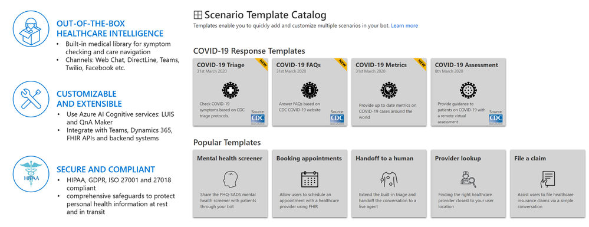
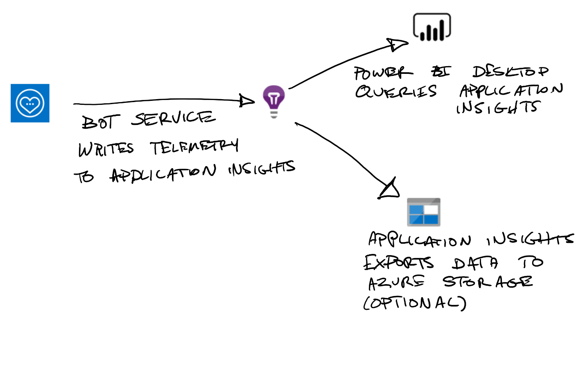
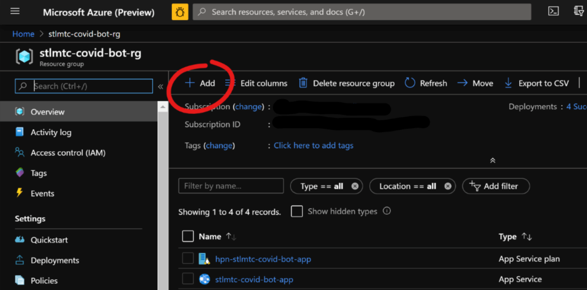

# The Health Bot Service and COVID-19 scenarios

The Health Bot Service is an AI-powered, extensible, secure, and compliant healthcare experience. Microsoft now has a specific template pre-built for COVID-19 Assessment. It takes incoming requests, asks about the patient&#39;s symptoms, and aids in getting people access to trusted and relevant healthcare services and information based on the CDC recommendation.

There is a great quick start which covers the deployment of the bot and scenarios [here](https://techcommunity.microsoft.com/t5/healthcare-and-life-sciences/updated-on-4-2-2020-quick-start-setting-up-your-covid-19/ba-p/1230537). We also have a Healthcare Bot Reference Architecture and deployment template [here](https://techcommunity.microsoft.com/t5/azure-ai/deploying-your-covid-19-healthcare-bot-everything-you-need-to/ba-p/1279562).

# But how are people using the bot?

After you have deployed the bot to your website and other channels, you really need to understand what people are doing and how it is potentially helping them. In addition, perhaps you are augmenting the data captured by the bot to include user identification, home facility of the user, etc. Questions you may have include:

- How many unique users completed the assessment scenario per day?
- How many unique users started but did not complete the assessment scenario per day?
- For users that did not complete the assessment, at what prompt did they stop?
- For users that completed the assessment, how many were directed to seek medical attention?
- For users that completed the assessment, how many said they have symptoms?

You may also want to filter or slice the above by any of the custom data elements you are capturing.

# Insights architecture

In addition to the components that the bot itself is using, we are going to augment those with the following technologies:

- Azure [Application Insights](https://docs.microsoft.com/en-us/azure/azure-monitor/app/app-insights-overview)
- Power BI Desktop ([free download](https://powerbi.microsoft.com/en-us/desktop/))
- Azure [Storage Blobs](https://docs.microsoft.com/en-us/azure/storage/blobs/storage-blobs-introduction)

Application Insights and Power BI are at the heart of the solution. Application Insights is an application performance management service that collects and analyzes telemetry and logs from your applications. Your bot natively understands how to save its usage telemetry to an Application Insights instance which you create. By default, Application Insights stores data for 90 days. You can choose to [change your retention up to 730 days](https://docs.microsoft.com/en-us/azure/azure-monitor/app/pricing#change-the-data-retention-period). Alternatively, you can [continuously export](https://docs.microsoft.com/en-us/azure/azure-monitor/app/export-telemetry) your telemetry data to the less expensive Azure storage for as long as you choose.

Power BI Desktop is a free tool that can natively connect to Application Insights to create dashboards and reports for local consumption. If you have access to the Power BI service, these reports can be shared with a wide audience by publishing. We have created a Power BI template that answers the questions posed above. You can use this template as-is or customize it based on your unique requirements.

# Insights configuration

You will perform the following steps to configure this solution:

1. Create an Application Insights resource in Azure
2. Configure your bot to write to Application Insights
3. Use Power BI Desktop to read data from Application Insights
4. Consume and share insights
5. (Optional) Use Azure Storage for long term storage of Application Insights data and consumption by other tools

## 1. Create an Application Insights resource

You should already have a resource group in Azure from your [initial bot deployment](https://techcommunity.microsoft.com/t5/healthcare-and-life-sciences/updated-on-4-2-2020-quick-start-setting-up-your-covid-19/ba-p/1230537). From here, click the &quot;Add&quot; button.

Search for Application Insights and click the &quot;Create&quot; button. Give your new resource a name and select the same region where your App Service is deployed. Click &quot;Review + Create&quot; and then &quot;Create&quot; on the following screen.

After your resource is created, open its blade and copy the Instrumentation Key from the overview pane. You will need this for the next step.

## 2. Configure your bot to write to Application Insights

Open your Health Bot instance. If you are the owner, you should be able to find your bot [here](https://admin.healthbot.microsoft.com/). Otherwise the owner will need to provide you the link.

Once your bot is open, navigate to &quot;Integration&quot; -\&gt; &quot;Secrets&quot; on the left menu. Select the appropriate option related to capturing conversation text and note the warning about potentially capturing PHI data by doing so. Finally, paste in the Application Insights Instrumentation Key you gathered in the earlier step. Click &quot;Save&quot;.

Even if you are not ready to report on your bot usage data you should enable Application Insights as soon as possible because you will begin tracking usage at once for reporting later. You cannot report on something you did not capture!

## 3. Use Power BI Desktop to read data from Application Insights

First, you will need download Power BI Desktop [here](https://powerbi.microsoft.com/en-us/desktop/). Next, you will need to download the pre-built Power BI Desktop template ([here](https://aka.ms/covidbotinsightstemplate)) that already knows how to pull data from Application Insights and has a report that answers the questions posed at the beginning of this article.

Double click the template (pbit) file you downloaded and enter data into the prompts as shown.

The Application Insights Application ID can be found in the &quot;API Access&quot; section of your Application Insights resource in the Azure portal.

The Number of Days selector specifies how many days&#39; worth of data will be read from Application Insights into Power BI Desktop. Click Load.

You will then be prompted to authenticate to Application Insights. Click &quot;Organizational account&quot; on the left and click &quot;Connect&quot;. You will need to have been given access to read from the Application Insights resource in the Azure portal before your login will allow you to extract data.

## 4. Consume and share insights

After your data has loaded, you should see a report like the one shown below.

Keep in mind that most visuals on a Power BI report are clickable and act as filters. For example, if you click one of the days in the bottom left bar chart, the entire report will be filtered to show data for that day. The chart showing completed vs. not completed can also be clicked to act as a filter. This should show you which messages were last shown to the user before the session was abandoned.

If you save this report it will end up as a pbix file on your local file system. You can refresh the data as often as you want by clicking the refresh button on the &quot;Home&quot; ribbon. If you have access to the Power BI service, you can publish this report for broader access within your organization.

### Advanced Data &amp; Reporting Topics

We have found that many customers are tracking custom data in their bots. If you need to get custom data from your bot&#39;s initialization payload, this Power BI report makes it easy. On the &quot;Home&quot; ribbon tab, click the &quot;Transform data&quot; button.

Select the &quot;Conversations&quot; query in the left pane and then note the query steps in the right pane. There is a step that brings in the initialization payload, parses its JSON, and then at once removes the parsed JSON record. If you have some custom data you need to gather from this payload, simply delete the step called &quot;Delete Init Payload JSON&quot; (by clicking the X highlighted below in yellow).

From here you can click the expand columns button in the InitPayload column as seen below. Make sure to click &quot;Load more&quot; so that Power BI can get a larger sampling of fields in this JSON object. Select the values you want to extract, uncheck the &quot;use original column name as prefix&quot; checkbox and click &quot;OK&quot;. You may need to set your new columns to appropriate data types. Finally, click the &quot;close &amp; apply&quot; button in the &quot;Home&quot; ribbon tab.

As a final advanced topic, if you find the data as-is does not represent the insights you need to extract, the Application Insights queries are embedded in the Power BI queries. These can be accessed in the Power BI Power Query/Transform Data screen in the &quot;View&quot; ribbon tab and by clicking the &quot;Advanced Editor&quot; button. More information about the Application Insights query language (also referred to as the Kusto Query Language) can be found [here](https://docs.microsoft.com/en-us/azure/kusto/query/).

## 5. (Optional) Configure Azure Storage for Application Insights data

If you do not want to leverage Power BI for reporting or if you simply want to capture the Application Insights log data for longer than 90 days (or whatever you changed the retention setting to), you can easily configure [continuous export](https://docs.microsoft.com/en-us/azure/azure-monitor/app/export-telemetry). Data stored in Azure storage is extremely inexpensive and can be saved for as long as is needed. In addition, any tool can be used to extract insights from the data stored there including Data Factory, Databricks, etc.

# Wrap up and next steps

There are a couple issues that are not necessarily accounted for yet in this report template. For example, if your bot is deployed with multiple languages, the report might not be optimally setup for reporting on outcomes.

In addition, the report is currently setup to pick out anonymous users by checking for a prefix of &quot;anon-&quot; on the username passed back from the Application Insights query. If you want to use this logic, you will need to configure your bot to write this prefix. If you have alternative logic to determine if a user is anonymous, you may need to change your bot, the Application Insights query, and/or the Power BI report.

All data is captured in Application Insights in the UTC time zone. The data is pulled into Power BI as UTC as well. You should keep this in mind as you are reviewing reports. This is especially relevant if you publish reports to the Power BI service and share with users across multiple time zones.

Finally, feel free to leverage the [GitHub repository](https://github.com/microsoft/mtc_covid_19/) where we are hosting the template for any issues, suggestions, or feedback. Pull requests are welcomed.

We hope this resource has proved valuable as you assess your health bot usage. Thank you for reading and let us know how we can help.

Todd Kitta [LinkedIn](https://www.linkedin.com/in/toddkitta/) | [Twitter](https://twitter.com/toddkitta)

Bryan Roberts [LinkedIn](https://www.linkedin.com/in/bryan-roberts-4325719/)

# Contributing

This project welcomes contributions and suggestions.  Most contributions require you to agree to a
Contributor License Agreement (CLA) declaring that you have the right to, and actually do, grant us
the rights to use your contribution. For details, visit https://cla.opensource.microsoft.com.

When you submit a pull request, a CLA bot will automatically determine whether you need to provide
a CLA and decorate the PR appropriately (e.g., status check, comment). Simply follow the instructions
provided by the bot. You will only need to do this once across all repos using our CLA.

This project has adopted the [Microsoft Open Source Code of Conduct](https://opensource.microsoft.com/codeofconduct/).
For more information see the [Code of Conduct FAQ](https://opensource.microsoft.com/codeofconduct/faq/) or
contact [opencode@microsoft.com](mailto:opencode@microsoft.com) with any additional questions or comments.
